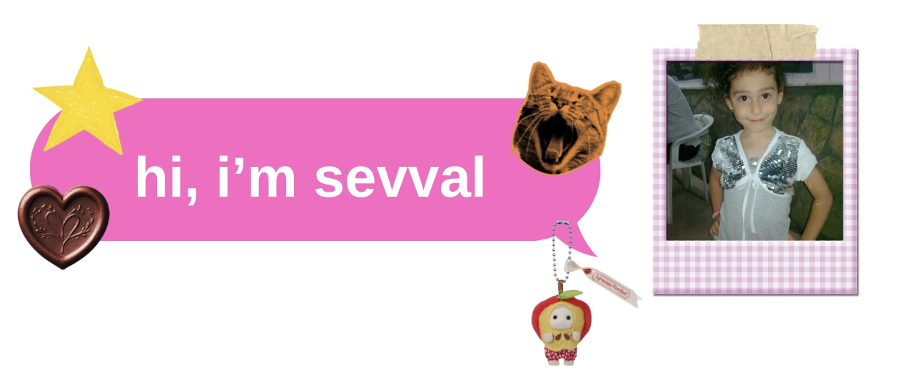

  

##  🎀  about me
🌼 turkish girl from istanbul, turkey  

🎓 mathematical engineering @ istinye university

📩 contact me: gurelsevval10@gmail.com

## 🗂️ projects

| project | description |
|--------|-------------|
| 🌟  autonomous cargo UAV | developed an autonomous UAV capable of cargo delivery and area inspection. |
| 🌸  object detection | training YOLOv8 models for object detection using aerial imagery. |
| 🌀  mathematics & python | implementing linear algebra, calculus, and visualization projects in Python. |
| 🎮  game development | making an overly cute suika game with my best friend. |
| 🤖  arduino projects | just trying new and fun stuff with arduino. |

## 💾 fav repos

| repo | description |
|--------|-------------|
| 🕹️ gesture recognition | face and hand gestures recognition with using opencv and mediapipe. |
<!---
purpliciouss/purpliciouss is a ✨ special ✨ repository because its `README.md` (this file) appears on your GitHub profile.
You can click the Preview link to take a look at your changes.
--->
